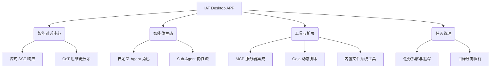

# IAT (Issueye AI Tool) 功能分析说明文档

## 1. 项目愿景与背景

### 1.1 项目定义

IAT (Issueye AI Tool) 是一款专为开发者设计的**下一代智能化集成开发辅助工具 (Agentic IDE)**。它不仅是一个 AI 聊天窗口，更是通过深度集成 MCP (Model Context Protocol) 和多智能体协作机制，将 AI 能力转化为实际生产力的任务执行引擎。

### 1.2 核心痛点解决

- **上下文断层**: 解决了通用 AI 无法实时访问本地代码库及工具的问题。
- **工具碎片化**: 通过统一的工具协议 (MCP) 集成各种开发工具，避免在不同工具间频繁切换。
- **任务复杂性**: 通过多 Agent 拆解与协作，将复杂的工程任务自动化。

---

## 2. 目标用户画像

- **软件工程师**: 需要高效的代码分析、重构、Bug 修复及自动化脚本编写。
- **系统架构师**: 用于快速生成原型、分析复杂 system 关联。
- **DevOps 工程师**: 通过集成系统工具实现自动化的运维与部署任务。

---

## 3. 功能架构分析

### 3.1 核心功能概览

### 3.2 模块详解

#### 3.2.1 智能对话与交互 (Core Chat)

- **多维度上下文**: 支持项目级、会话级、以及基于 Agent 角色的上下文注入。
- **思维可视化**: 采用 `<think>` 标签拦截并独立渲染 AI 的思考链条，增强人机信任。
- **即时响应**: 深度优化 SSE 输出，确保交互的流畅性。

#### 3.2.2 智能体协作系统 (Multi-Agent System)

- **Agent 定义**: 用户可配置提示词、模型参数、绑定的工具集。
- **递归协作 (Sub-Agent)**: 引入 `call_subagent` 动作，允许 Agent 启动具有特定技能的子 Agent 协同工作，形成流水线模式。
- **A2A (Agent to Agent) 通信**: 预研中的 Agent 间标准协议，支持跨进程甚至跨主机的 Agent 通信。

#### 3.2.3 工具生态与协议 (Tooling & Protocols)

- **MCP 深度支持**: 业界领先的 Model Context Protocol 适配，一键连接 GitHub、Slack、DB 等外部服务。
- **动态脚本引擎**: 集成 Goja，支持 JS/Python 编写即插即用的工具，无需重启应用。
- **本地项目索引**: 基于 GoLevelDB 的倒排索引，赋予 Agent 瞬间定位全局代码的能力。

#### 3.2.4 任务编排与治理 (Tasking)

- **状态感知**: 任务具备生命周期（待办、进行中、已完成、失败）。
- **结果交付**: 强调以“达成目标”为核心，而非仅提供文字建议。

---

## 4. 业务流程 (User Journey)

1. **项目导入**: 用户打开本地代码目录，系统自动构建代码索引。
2. **场景定制**: 选择或配置合适的 Agent（如 "代码专家"、"重构大师"）。
3. **发起任务**: 输入需求（如 "帮我把这里的异步逻辑优化一下"）。
4. **思考与编排**: AI 拆解任务，调用相应工具（读取文件、修改代码、运行命令）。
5. **协作执行**: 如遇复杂任务，主 Agent 召唤 Sub-Agent 处理细节。
6. **反馈与归档**: 用户确认结果，任务标记完成。

---

## 5. 核心价值主张 (Value Proposition)

1. **开放性**: 拥抱 MCP 协议，不绑定单一云端服务。
2. **私密性**: 本地运行后端 (`engine`)，核心数据不出本地。
3. **可扩展性**: 强大的动态脚本与 Agent 定制能力，跟随开发者习惯进化。

---

## 6. SWOT 分析

| 优势 (Strengths)                                                           | 劣势 (Weaknesses)                                                        |
| :------------------------------------------------------------------------- | :----------------------------------------------------------------------- |
| 跨平台 Wails 架构，性能与 UI 兼顾；深度集成 MCP；强大的多 Agent 协作思路。 | 错误处理尚未标准化；并发执行 Sub-Agent 存在阻塞隐患；测试覆盖率较低。    |
| **机会 (Opportunities)**                                                   | **威胁 (Threats)**                                                       |
| 开发者对本地高效 Agent 工具需求激增；MCP 协议生态正步入快速爆发期。        | 诸如 Cursor, Windsurf 等原生 AI IDE 的强力竞争；云端生态的连通平衡挑战。 |

---

## 7. 产品 Roadmap (建议)

- **短期 (Q1)**:
  - 完善工具执行的容错机制与标准化错误输出。
  - 实现本地 RAG (检索增强生成) 能力，提升长文本关联度。
- **中期 (Q2)**:
  - 推出 Skill 市场，支持用户共享 Agent 配置与脚本工具。
  - 优化 Sub-Agent 并发模型，引入消息队列。
- **长期 (Q3)**:
  - IDE 插件化（VS Code 插件分支）。
  - 支持多端 Agent 同步与云端协作模式。

---

**编写者**: Antigravity (PM Mode)
**日期**: 2026-01-23
